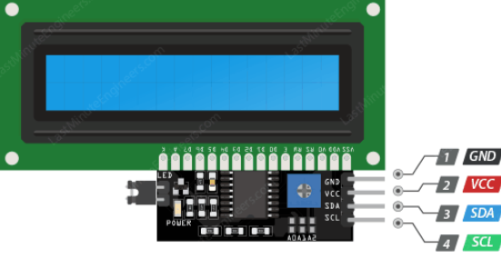
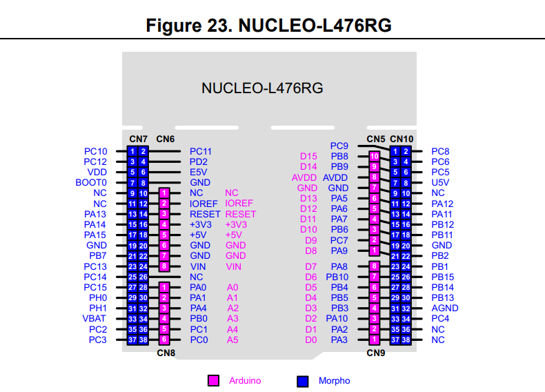

# Guessing Game

Guessing Game implementation using
- Rust
- Embassy
- STM32L476RG
- LCD with I2C adapter
- "Car mp3" remote control
- IR receiver

### Before run:
`$ rustup target add thumbv7em-none-eabihf`

### IR connection

|IR pin | STM32 pin |
|-|-|
|Output | PA0 (A0) |
| VCC | +3V3 |
| GND | GND |

### LCD connection

| LCD pin | STM32 pin |
|-|-|
| SDA | SDA/D14/PB9 |
| SCL | SCL/D15/PB8 |
| VCC | +3V3 |
|GND | GND |

### STM32 pin reference

Screenshot are taken from [here](https://www.st.com/resource/en/user_manual/um1724-stm32-nucleo64-boards-mb1136-stmicroelectronics.pdf).

### Car mp3 remote control

### Run program
- Connect microcontroller to PC and run `cargo run`
- Use "Car mp3" remote controller to interact with application by pressing 0-9 buttons, use <kbd>>>|</kbd> button to submit answer and <kbd>|<<</kbd> button to erase last digit.

### Game flow
- App generates a random number between 1 and 100
- User submits guesses via a remote control
- System provides feedback on whether the guess is higher or lower than the target
- "Victory" title is displayed once the correct number is found

### Demo
<kbd><a href="https://youtube.com/shorts/eCo_wzpjWcQ?feature=share">Watch demo video on Youtube</a></kbd>
